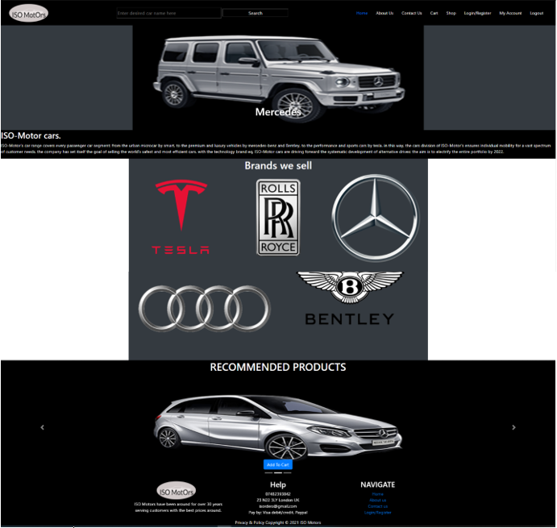
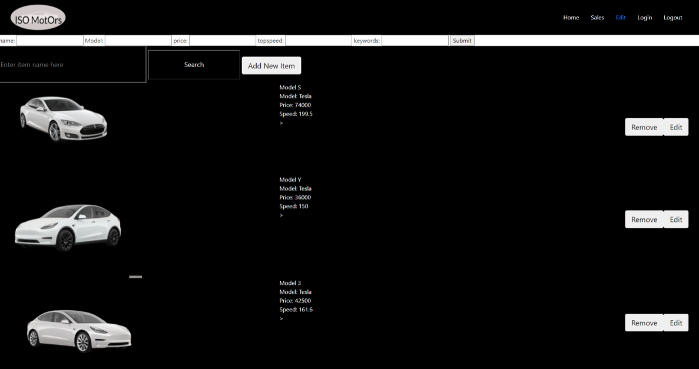

# ISO-Motors-E-commerce-Website
- Developed an e-commerce website by employing PHP and MongoDB to manage the products and users.
-	Implemented a CMS enabling staff to add products and view orders.
-	Utilized AJAX, PHP sessions, and JavaScript to build a shopping cart, log-in, and registration system that allows customers to shop for multiple items and access their purchase history.
-	<b>Utilised</b>: PHP, MongoDB, JavaScript, AJAX, HTML/CSS

  <h3>Home page</h3>
  
  
  <h3>Shop page</h3> 
  
  
  <h3>Shopping Cart Page</h3> 
  
  
  <h3>My Account Page</h3>
  
  
  <h3>Login/Registration Page</h3>
  
  
  <h3>CMS Edit Sales History Page</h3>
  
  
  <h3>CMS Edit Products Page</h3>
  
   
